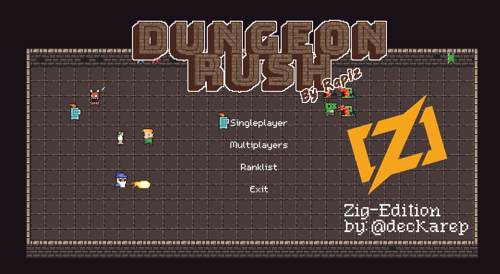

# DungeonRush in Zig!

This is a near exact **Zig port** of the [original DungeonRush `C-based`](https://github.com/rapiz1/DungeonRush) rogue-like game running on SDL2 originally developed by @rapiz1.

## Status
* Fully playable - confirmed working on MacOS, Linux Mint
* Nearly complete port, no networking or auxillary menus done
* No known bugs.
* Many memory leaks were tracked down and fixed using Zig's `GeneralPurposeAllocator` leak detection feature
* Game speed is now appropriately throttled and consistent across platforms.
* Code is largely done, but now being incrementally improved, refactored and cleaned-up

## A twist on classic Snake
* DungeonRush is a pretty fun game:
  * Cellular automata to generate random dungeon levels
  * Features weapons, buffs, enemies, bosses and loot drops
  * Classic pixel art and animations
  * 8-bit style music and many sound sfx

## How to play
* Each round starts with a random hero in the middle
* Move the arrow keys: up, down, left, right to control your character
* Make your party stronger by collecting more heroes
* Collect weapon and loot drops to become more powerful and heal up
* Don't run into walls, bad guys or yourself
* Your heroes will intelligently attack nearby enemies
* To advance to the next round, you must collect a certain amount of heros
* Be careful of giant bosses, they are very strong

## Port Goals
* To re-create a moderately complex game, fully in Zig and to get better at the language.
* To make this port faithful to the original, while being more idiomatic.
* To identify and fix any *possible* undefined behaviors or bugs that the Zig compiler catches or
  that myself or other contributors catch.
* To ensure the game is as fast and responsive as the original project.
* To fully eradicate all original C-based files and C-based build scripts.
* To port in phases:
  1. Phase 1: port the C code almost as-is to minimize bugs introduced
      * ✅ Deprecated usage of `c.malloc`/`c.free` in all cases
      * ✅ Deprecated use of `c.qsort` with a `callconv(.C)` callback in favor of Zig's sorting.
      * Deprecate all [*c] style pointers
      * ✅ Deprecated C-style multi-pointers
      * Find and improve `const` correctness in some cases.
  2. Phase 2: Ziggify
      * Move away from `c_int` or C specific types
      * ✅ Favor slices over multi-pointers, remove any pointer arithmetic.
      * Use more of Zig's stdlib for logging, file-io, etc.
      * Utilize `defer`/`errdefer` for effective cleanup
      * Migrate to a Zig-based SDL wrapper, for a nicer SDL experience.
      * Ensure all errors are accounted for, utilize `try`
      * Use build.zig.zon
      * Setup Github to build the project regularly
  3. Phase 3: Code Clean-up/Refactor
      * Remove duplicate code
      * Make code even more idiomatic for Zig
      * Make the code more maintainable
      * Use less globals
      * Fix namespace issues
      * Remove redundant naming like some enumerations have their container name as the prefix
      * ✅ Use some Zig based collections like the `generic` LinkList over the original C ADT style
      * Bonus: Introduce unit-tests
      * Get building for other OSes (w/ community contributions)
      * Migrated hardcoded textures, music + sound sfx out of the source code and into config files
        * This will allow the game to be easily skinned, for a whole new experience.
  4. Phase 4: ???
      * I'd love to port this to Raylib.

## More baddies?
  * [pixel-sprite-mixer](https://kingbell.itch.io/pixel-sprite-mixer)

## Why Zig?
Cause it's a game-changing, bad-ass language that unlocks super-powers and was a fun learning experience.

## Source
  * `zrc/` - Ziglang port (by @deckarep)
  * `src/` - C-based version (original by @rapiz1)

## Installing and Running
  * Built and tested against [Zig 0.13.0](https://ziglang.org/documentation/0.13.0/) release
  * Ensure SDL2 is installed for your OS/Platform
  * From the root folder: `zig build run`

## Contributions
Want to hack on this project with me? I will welcome all contributions that improve the code while keeping it faithful to the original DungeonRush project. I'd like the game to look and run identical. I'd like help with the phases outlined above. There's plenty of low-hanging fruit that is relevant to beginners and experienced a-like.

However, code will be rejected that needlessly complicates the game or does not run identical to the original C project.

If people want to change the overall look and feel or game logic, please fork DungeonRush and change it however you like! It is open-source after all!

## Callouts and Caveats
* Zig doesn't have `do/while` so they've all been replaced with `while` with a break on a `negated` condition.
* Before anyone complains about the port looking like ugly Zig code written like C, this is why I'm taking a multi-phase approach. If you've ever done migrations, changing too many things at once introduces bugs, especially when tests don't exist.
* All original development was done on Apple MacOS Silcon, contributions are welcome for other OSes.
* The game has some multi-player networking code, I don't care about it at the moment so it's not started.
* It's very possible this manual port has introduced a bug or two, the game needs to be well tested.

## Future ideas
* Introduce heroes that have innate abilities like a Frost Hero that is immune to cold attacks
and is able to dish out there own cold attacks. Or a Fire Hero that can't be frozen. Yeah,
dumb shit like that.
  * This would make the game a little more interesting because you can pick up cerrtain heroes
  as part of the strategy to help you cope with the certain level.
* Introduce themed levels, like a frost level where most or all baddies are cold-based.
* Introduce upgrades along the way, pick up treason, loot upgrade your heroes.
* Gamepad support, it might be fun to not always use the damn keyboard.